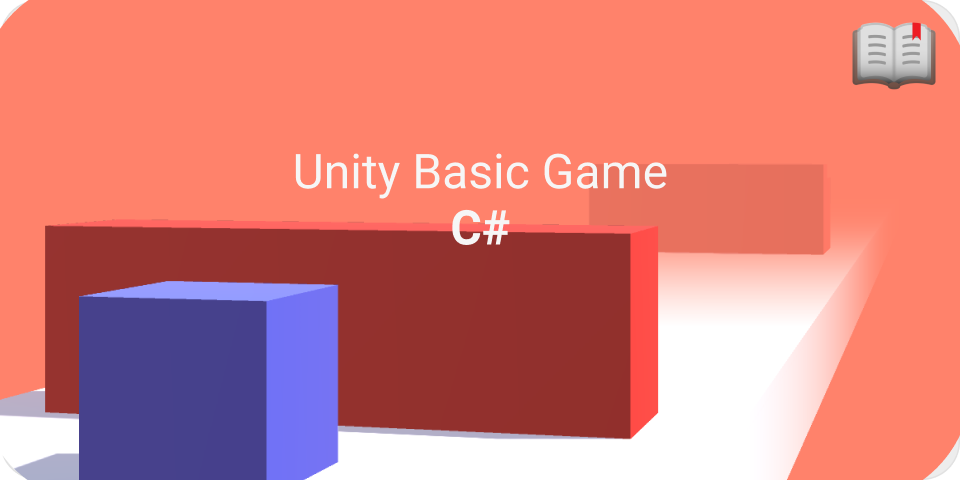
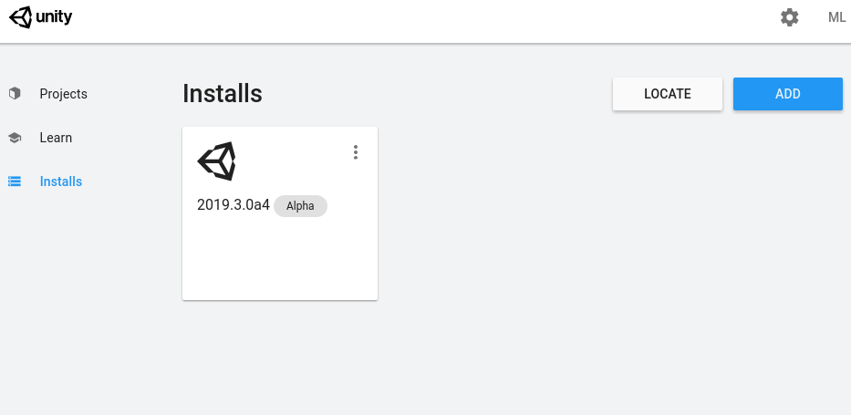
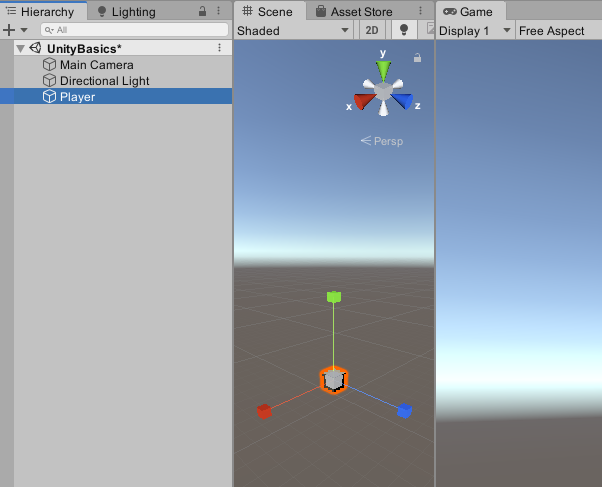
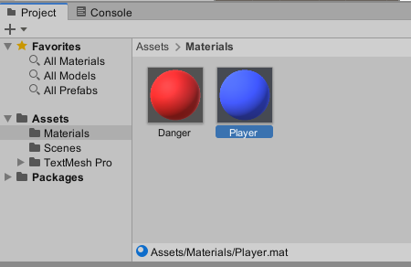
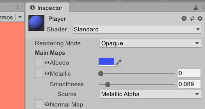
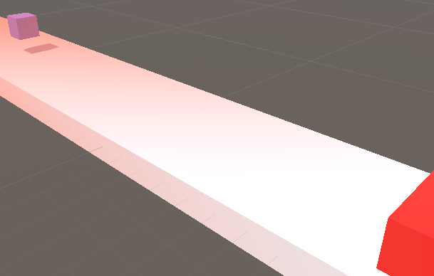
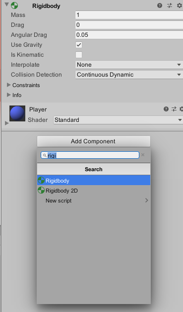
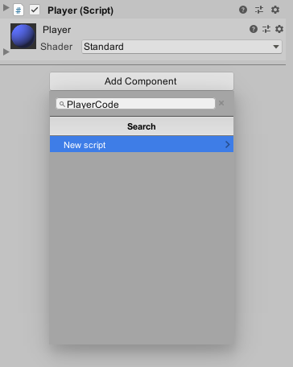
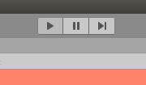
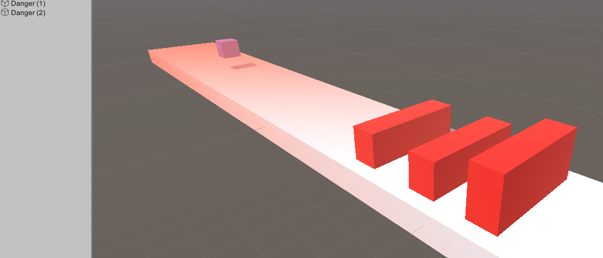

# 🎮 UnityBasics & C# 🎮

Let's create a infinite runner using **Unity** and C#, it will be the perfect opportunity to learn how to use **Unity** and a bit of modern C# too!

---

## Installing Unity and creating our first project.

> Finally Unity Editor for Linux.
https://blogs.unity3d.com/2019/05/30/announcing-the-unity-editor-for-linux/

Download and install the **Unity Hub**
https://forum.unity.com/threads/unity-hub-v-1-6-0-is-now-available.640792/

Now let's start by creating a **new** proyect, give it a name, and launch it!

## The basics.

The whole idea is to have a player that jumps to avoid getting pushed back by some moving walls.

First let's create the environment, a floor, a player cube and a 'danger' wall.

> Right click on the left 'scene' window, on the tooltip menu: 3d Object > Cube ... Do the same for a floor and a simple wall.

Let's give them different **materials** so they are not completely white.

> Right click on the bottom 'Project' window, on the tooltip menu: Create > Material ... Do the same for a floor and a simple wall.

Blue for the player and red for the walls.

Now to apply our new materials, drag and drop them on top of the gameobjects we previously created.

You should arrange the gameobjects like the following screenshot.

---

## Physics and the Player.

Let's use Unity's physics engine to help our player jump, so instead of moving the actual cube, let's add a **component** to our gameobject that will tell unity to handle this gameobject as a physics capable entity.

Using the same **Add Component** menu, you can also add/create new scripts that are connected to that particular gameobject.

Let's create a new script called Player.

> You will see our newly created script on the bottom **Project** window, Right click, open containing folder, and edit it in your favorite editor.

## C# and the Player's logic.

Let's quickly talk about the unity's C# code architecture, it's simple:
* First we have a 'Start' function, called at the begining on our game, right before the first frame. We could use this to initialize variables and such.
* The 'Update' function, called right before each frame. This is where we are going to be detecting for user input and more.

## Player's movement.

Given that our floor gameobject is a 'collider' this means our player that has a 'rigidbody' will collide with this floor.

To make our player jump, we would need to **add a force** to our 'rigidbody' to make it move upwards.

Create a variable where we are going to store our rigidbody.

    private Rigidbody rb;

Now we need to set it up on our 'Start' function, using the **GetComponent** function that exists in the **gameObject** object that every **MonoBehaviour** has, you can access it directly.

    void Start()
    {
        rb = gameObject.GetComponent<Rigidbody>();
    }

**User Input** is really easy in Unity, in our 'Update' function let's check if the user pressed the 'Space Bar' key, using the **GetKeyDown** function, accesible from the global **Input** class.

If the function returns true, now we tell our rigidbody to add force using it's **AddForce** function.

    void Update()
    {
        if (Input.GetKeyDown("space"))
            rb.AddForce(0, 300, 0);
    }

### Launching the game:
Click on the play button to launch the game, you will see your player cube fall down with gravity and if you press space it will jump.

> Bug Fix: Don't forget to verify that the player has landed before letting him jump again.

    void Update()
    {
        if (Input.GetKeyDown("space") transform.position.y < 1.1)
            rb.AddForce(0, 300, 0);
    }

If our player gets pushed down by a wall, we need to put him back to the starting position, let's check if our player went too far from a point and set him back to a **spawnPosition**, let's create a variable and set it up on the 'Start' function.

    public Vector3 spawnPosition;

    void Start()
    {
        rb = gameObject.GetComponent<Rigidbody>();
        spawnPosition = new Vector3(0, 1, 0);
    }

Now we should check if our player went too far from the playable area and move him back to the 'spawnPosition', using the **transform** object we can easily access to the position, and reset it.

    void Update()
    {
        if (transform.position.z < -2.5 || transform.position.y < -1)
            transform.position = spawnPosition;
        if (Input.GetKeyDown("space") && transform.position.y < 1.1)
            rb.AddForce(0, jumpForce, 0);
    }

## The moving walls.

Now let's add a new script (component) to our **wall** gameobject, calle it **wall** or **danger**.

Inside let's move our wall close to the player on each frame, by using the **Translate** function inside the **transform** object, it takes a **vector** and moves the transform using the given direction.

Using **Vector3.forward** we could go towars the forward axis of the actual gameobject, so doing **-Vector3.forward** means we go backwards!.

> Hint: Movement should be always multiplied by the Engine's DeltaTime (how many seconds took the last frame to finish rendering) and a constant (17) that let's us control the speed in our case.

    void Update()
    {
        transform.Translate(-Vector3.forward * Time.deltaTime * 17);
    }

If we play the game now we'll see that our walls are going to move towards the given direction.

Now we need to check if our wall went too far and bring it back to a position where it will come back at the player again.

Given that we can have multiple walls let's make them come at different rates using the **Random.Range** function to give a bit of randomness to the start position of our walls.

    void Update()
    {
        if (transform.position.z < -10) {
            spawnPosition.z = Random.Range(35, 45);
            transform.position = spawnPosition;
        }
        transform.Translate(-Vector3.forward * Time.deltaTime * Speed);
    }

If you play the game the walls will come towards the player and push him back, and when either the wall or the player go outside of the wanted game range, they will 'spawn' back into the 'game'.

### Multiple walls.

Having a wall is ok, but let's create more walls, just by duplicating the one we have, it will maintain the script we created.

## Enjoy!

Now your game is completed!, know you know how to create gameobjects and give them scripts that change their behaviour. Try on giving it your own touch!